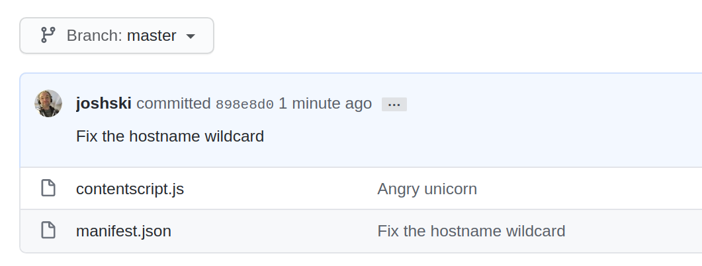
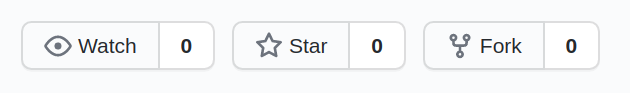
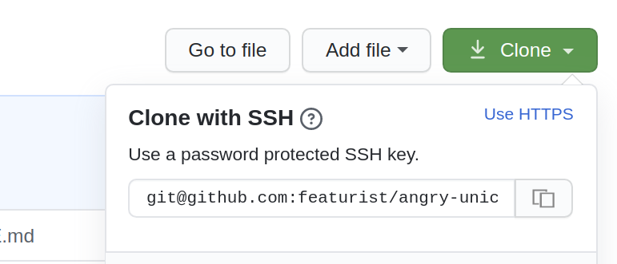

# angry-unicorn
A browser extension that fixes issues with the Github UI when they implement design changes

## Install in Chrome

Clone this repo, go to [chrome://settings](chrome://settings), click "Load unpacked" and select the root directory of the repo.

## Tweaks

### Show the latest commit message on the default branch

### Fix the vertical alignment of icons in the header

### Replace the paste icon with an old-school copy icon

